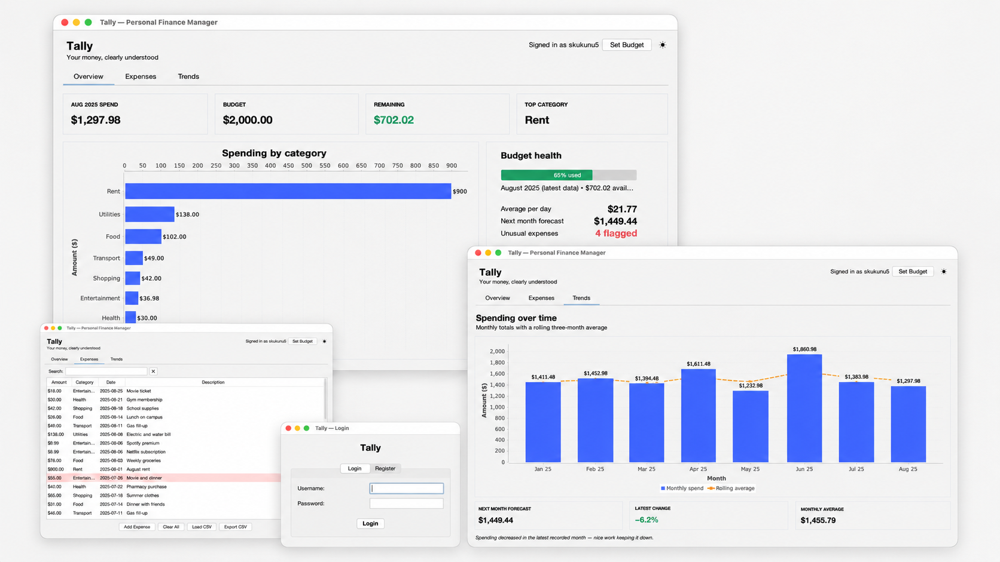
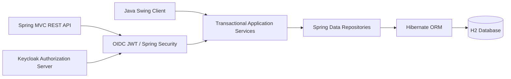

# Tally

Tally is a secure, Java-first personal finance manager for tracking expenses, budgets, and spending trends. It pairs a polished Swing desktop experience with a Spring Boot REST API backed by Hibernate and OAuth 2.0.



## What It Is

Tally is a Java-first personal-finance platform that combines a modern Swing desktop client with a secured Spring REST API. Both interfaces share the same transactional service layer, Hibernate domain model, and user-isolated data.

It treats money correctly with `BigDecimal`, models expenses and budgets through JPA relationships, authenticates API users with Keycloak OIDC, and provides category analytics, rolling averages, forecasting, and anomaly detection. The running application also generates its own OpenAPI contract and interactive Swagger documentation.

## Architecture



The UI and HTTP controllers are adapters. Business operations live in `ExpenseService`, `BudgetService`, and `UserService`; neither client bypasses them. See [Architecture](docs/architecture.md) for component boundaries, entity relationships, and design decisions.

## Tech Stack


## Run

Requirements: Java 21+, Maven 3.8+, and Docker Desktop (for API login).

For a first run, start Keycloak, build Tally, and then start the application:

```bash
docker compose up -d
mvn clean package
java -jar target/tally-1.0.0.jar
```

Allow Keycloak roughly 20 seconds to initialize after its first start. Tally then
opens the Swing client and serves the API on `http://localhost:8080`.

For API-only mode:

```bash
java -jar target/tally-1.0.0.jar --app.ui.enabled=false
```

## Demo profile

The demo profile safely seeds one account and current-month expenses only when that account has no data:

```bash
java -jar target/tally-1.0.0.jar --spring.profiles.active=demo
```

- Username: `tally-demo`
- Password: `demo123`

The repository also includes [sample_expenses.csv](sample_expenses.csv) for testing historical imports.

## OAuth / OpenID Connect

Start the development identity provider:

```bash
docker compose up -d
```

Keycloak runs at `http://localhost:8180` and imports the versioned `tally` realm. The development account is `tally-demo` / `demo123`. The `tally` client is public and requires Authorization Code with PKCE; no client secret is stored in the desktop application or repository.

The REST API validates JWT bearer tokens and authorizes four scopes: `expenses.read`, `expenses.write`, `budget.read`, and `budget.write`. An OIDC subject is mapped to a local Hibernate user on first API access. Offline Swing accounts continue to use local BCrypt authentication.

### First Swagger login

1. Open `http://localhost:8080/swagger-ui.html` and click **Authorize**.
2. Keep `client_id` set to `tally` and leave `client_secret` empty.
3. Click **select all** to grant the four displayed scopes, then click **Authorize**.
4. Sign in on the Tally Keycloak page with username `tally-demo` and password `demo123`.
5. After returning to Swagger, close the authorization dialog.
6. Open `GET /api/expenses`, click **Try it out**, and then **Execute**. A `200` response confirms that OAuth and the API are working.

Do not log into Keycloak's `master` realm for normal API use. The Keycloak admin
console is separate and uses the development administrator credentials `admin` / `admin`.
If a previously created Docker volume does not contain the demo realm, recreate only
the Keycloak development data and import the checked-in configuration again:

```bash
docker compose down -v
docker compose up -d
```

This does not delete Tally's `finance-db` expense database.

## REST API

Interactive documentation is available after startup:

- Swagger UI: `http://localhost:8080/swagger-ui.html`
- OpenAPI JSON: `http://localhost:8080/v3/api-docs`

All `/api/**` endpoints use OAuth bearer tokens and infer ownership from the immutable JWT `sub` claim there is no user ID in a request path to tamper with. Click **Authorize** in Swagger UI to sign in through Keycloak with PKCE.

```bash
# Get all expenses
curl -H "Authorization: Bearer $ACCESS_TOKEN" http://localhost:8080/api/expenses

# Create a new expense
curl -H "Authorization: Bearer $ACCESS_TOKEN" -H 'Content-Type: application/json' \
  -d '{"amount":24.75,"category":"Food","date":"2026-06-19","description":"Dinner"}' \
  http://localhost:8080/api/expenses

# Update the monthly budget
curl -H "Authorization: Bearer $ACCESS_TOKEN" -X PUT -H 'Content-Type: application/json' \
  -d '{"amount":2500.00,"period":"monthly"}' \
  http://localhost:8080/api/budget
```

See [API usage](docs/api.md) for the complete endpoint table and response examples.

## Persistence and migration behavior

Tally uses a file-backed H2 database at `./finance-db`. On upgrade from the original global-data schema, legacy rows are assigned once to the oldest local account before normal use. New writes cannot enter through an application service without an owner.

## Tests

```bash
mvn test
```

The suite covers value objects, CSV parsing, analytics, user isolation, Hibernate mappings, authentication, and budget-period behavior.

## Design Decisions

| Decision | Why It Matters |
|---|---|
| **Swing desktop client** | Tally is intentionally Java-first. The desktop UI demonstrates event-driven Java development while reusing the same service layer as the API. |
| **Spring Boot REST API** | The backend exposes finance data through a structured API with authentication, validation, and Swagger documentation. |
| **H2 local database** | H2 keeps the project easy to run locally with no external database setup. The repository layer keeps future PostgreSQL migration straightforward. |
| **Hybrid authentication** | The Swing app supports local BCrypt login for offline use, while the REST API uses Keycloak OIDC and JWT scopes for secure API access. |
| **BigDecimal for money** | Financial values are stored and returned with exact decimal precision. Charts and forecasts only convert values when doing analytics calculations. |

## License

Apache License 2.0. See [LICENSE](LICENSE).

## Author

Built by [Sai Rithwik Kukunuri](https://www.linkedin.com/in/rithwik0801).

If this project is helpful, consider leaving a ⭐. Feedback and suggestions are always welcome.
