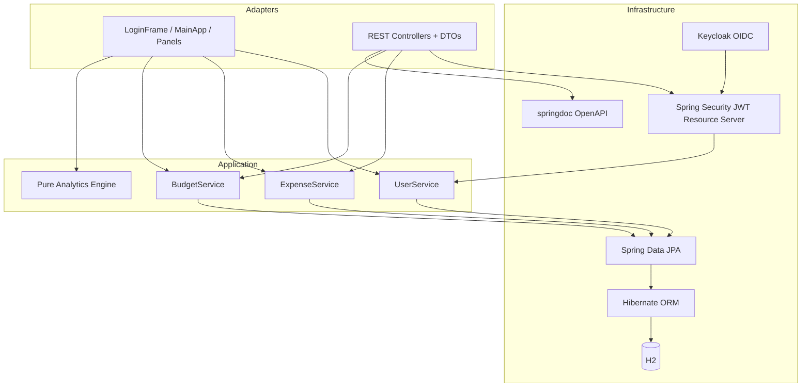
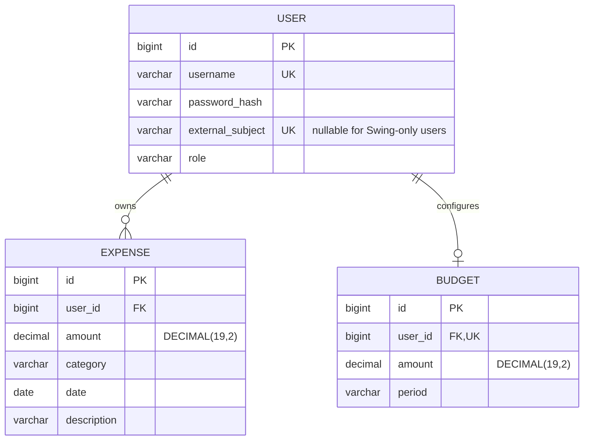
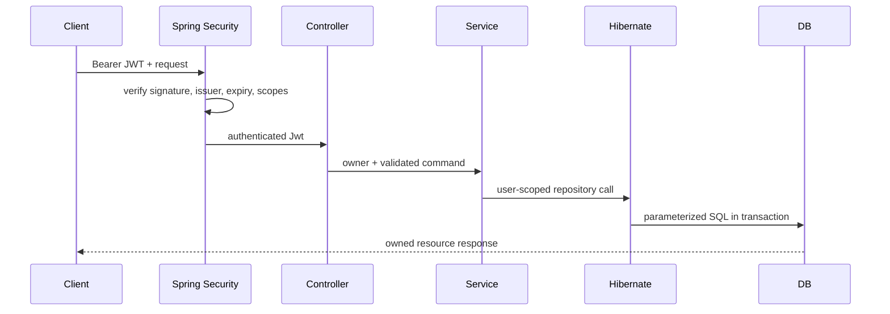

# Architecture

## Component model

## Data model

The budget's unique `user_id` foreign key encodes the one-budget-per-user invariant in both the object model and database while allowing the v1 singleton row to be migrated without data loss.

## Request path

## Boundaries and invariants

- Controllers never accept an owner ID; they derive the owner from the immutable OIDC `sub` claim.
- Spring Security maps token scopes to `SCOPE_...` authorities before controller dispatch.
- Swing passes the authenticated `User` into the same services.
- Services define transaction boundaries and require an owner for every expense or budget operation.
- DTOs prevent persistence entities and password fields from leaking over HTTP.
- Monetary persistence uses `BigDecimal`; floating point is limited to visualization and statistical algorithms.
- Repository method names include `Owner`, making accidental global queries visible during review.

## Production evolution

For a hosted version, add Flyway, PostgreSQL, OAuth2/OIDC, Testcontainers, structured audit events, and optimistic locking. These changes fit behind the current adapter and repository boundaries without replacing the Swing client or domain services.
